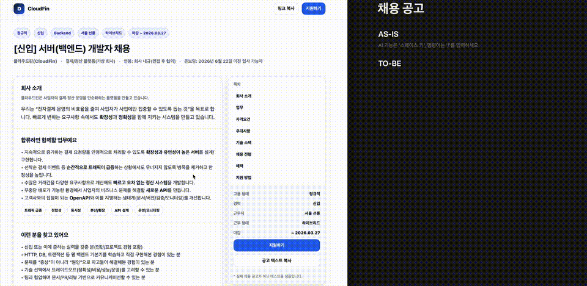
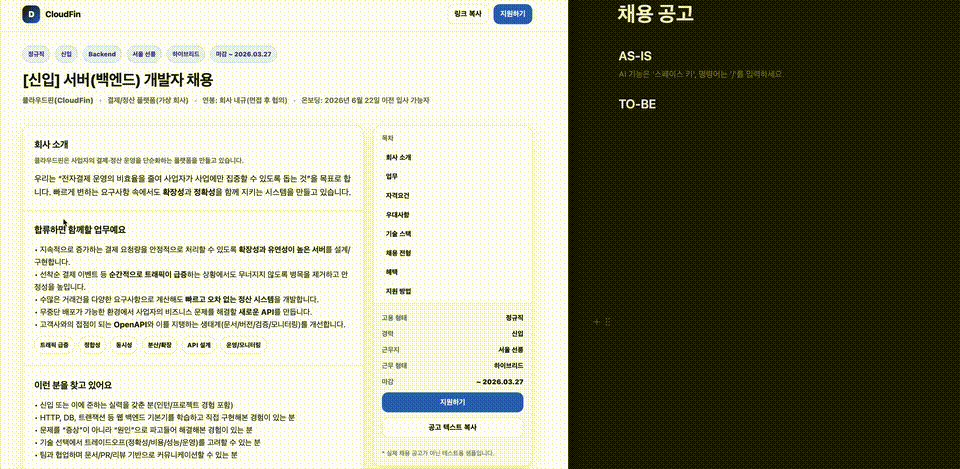

# DragOn

[English](README.md) | 한국어

DragOn은 웹페이지에서 선택한 텍스트를 Markdown으로 복사하거나, 선택 영역을 이미지로 캡처하는 크롬 확장입니다. 링크가 사라지기 전에 JD 등 원문을 보관하고, 노션에 구조화해서 붙여넣는 용도로 설계되었습니다.

[크롬 웹 스토어에서 설치하기](https://chromewebstore.google.com/detail/miaghigponialmpepeeahhbcmhifgaim?utm_source=item-share-cb)

## 할 수 있는 일

- `Alt+Shift+D`: 선택 영역을 Markdown으로 복사
- `Alt+Shift+C`: 선택 영역을 PNG로 캡처하고 오버레이에서 다운로드/복사
- 성공/실패/선택 없음에 대한 토스트 안내
- 분석/클라우드 동기화 없음. 이미지 캡처 시 선택 영역 내 이미지 리소스를 인라인하기 위해 fetch할 수 있습니다.

macOS에서는 `Option` 키가 `Alt`와 동일합니다. 기본 단축키는 `Alt+Shift+D`, `Alt+Shift+C`입니다.

### 마크다운 복사

선택 영역의 텍스트 콘텐츠를 마크다운으로 변환하여 클립보드에 복사합니다. 웹페이지의 구조에 따라 제목, 리스트, 링크 등이 마크다운 문법으로 변환됩니다.

영상은 기본 복사 커맨드를 사용하는 모습과 `Alt+Shift+D` 단축키를 사용하는 모습을 보여줍니다. 단축키 사용 시 선택 영역이 마크다운으로 변환되어 클립보드에 복사되고, 토스트 알림이 표시됩니다.

### 이미지 캡처

선택 영역을 PNG 이미지로 캡처하면 팝업 오버레이가 뜨고, 다운로드하거나 클립보드에 복사할 수 있습니다. 캡처된 이미지는 선택 영역의 시각적 표현으로, 텍스트뿐만 아니라 스타일과 레이아웃도 포함됩니다.

영상에서는 기본 복사 커맨드를 사용하는 모습과 `Alt+Shift+C` 단축키를 사용하여 선택 영역을 이미지로 캡처하는 모습을 보여줍니다. 캡처된 이미지는 다운로드되거나 클립보드에 복사될 수 있으며, 토스트 알림이 표시됩니다.

## 설치

1. 의존성 설치: `npm install`
2. 빌드: `npm run build`
3. 크롬에 로드: `chrome://extensions`에서 개발자 모드를 켜고 "압축해제된 확장 프로그램 로드"를 눌러 `dist` 폴더를 선택합니다.

## 사용 방법

1. 웹페이지에서 텍스트를 드래그해 선택
2. `Alt+Shift+D`로 Markdown 복사, `Alt+Shift+C`로 이미지 캡처
3. 단축키 변경은 `chrome://extensions/shortcuts`에서 가능

## 마스코트

드래곤입니다.

## 라이선스

MIT
